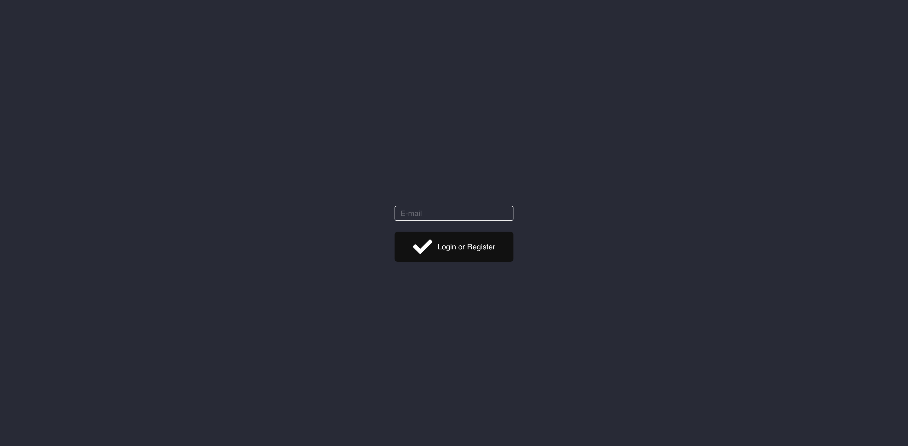
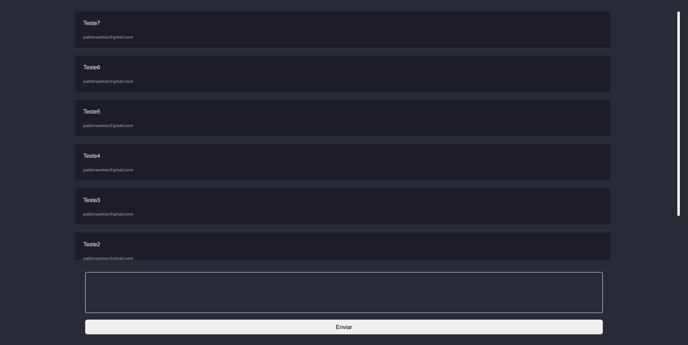

<h1 align="center">
   Messages Board
</h1>

<p align="center">

   <a href="https://www.linkedin.com/in/pablo-rosa-68136a1b2/">
      
   </a>
  

  <a href="https://github.com/PabloRSantos/proffy/commits/master">
    
  </a>

</p>

> Projeto feito para aprender como é a integração entre NestJS, GraphQl e TypeORM, baseado no video [NestJS + TypeORM + GraphQL | Code Challenge](https://www.youtube.com/watch?v=nDN4JRbFEns&ab_channel=Rocketseat) da @Rocketseat


<div align="center">
  <sub>pProjeto feito com ❤︎ por
    <a href="https://github.com/PabloRSantos">Pablo Rosa</a>
  </sub>
</div>

# :pushpin: Índice

- [Sobre](#sobre)
- [Tecnologias Utilizadas](#tecnologias-utilizadas)
- [Como Usar](#como-usar)
- [Como Contribuir](#como-contribuir)

<a id="sobre"></a>

## :bookmark: Sobre

O <strong>Messages Board</strong> é uma aplicação Web de mensagens publicas em tempo real.


<a id="tecnologias-utilizadas"></a>

## :rocket: Tecnologias Utilizadas

O projeto foi desenvolvido utilizando as seguintes tecnologias

- [TypeScript](https://www.typescriptlang.org/)
- [Node.js](https://nodejs.org/en/)
- [ReactJS](https://reactjs.org/)
- [NestJS](https://nestjs.com/)
- [TypeORM](https://typeorm.io/#/)
- [Styled Components](https://styled-components.com/)
- [Apollo Client](https://www.apollographql.com/docs/react/)
- [GraphQl](https://graphql.org/)

### Projeto Web
<div>
   
   
</div>

<a id="como-usar"></a>

# :construction_worker: Como usar
  ### **Pré-requisitos**

  - É **necessário** possuir o **[Node.js](https://nodejs.org/en/)** instalado na máquina
  - Também, é **preciso** ter um gerenciador de pacotes seja o **[NPM](https://www.npmjs.com/)** ou **[Yarn](https://yarnpkg.com/)**.
  - Por fim, é **essencial** ter o **[Expo](https://expo.io/)** instalado de forma global na máquina

```bash
# Clone o repositório
$ git clone https://github.com/PabloRSantos/MessageBoard.git
```
### 📦 Execute a api

```bash
# Entre na pasta backend
$ cd MessageBoard/backend

# Instale as depêndencias
$ yarn install

# Execute a aplicação
$ yarn start:dev
```
Acesse a API em http://localhost:3333/

### 💻 Execute o projeto web

```bash
# Entre na pasta web
$ cd MessageBoard/web

# Instale as depêndencias
$ yarn install

# Execute a aplicação
$ yarn start
```
Vá para http://localhost:3000/ para ver o resultado.

<a id="como-contribuir"></a>

## :tada: Como contribuir

- Faça um Fork desse repositório
- Crie uma branch com a sua feature: `git checkout -b my-feature`
- Commit suas mudanças: `git commit -m 'feat: My new feature'`
- Push a sua branch: `git push origin my-feature`

---

<h4 align="center">
    Feito com 💜 by <a href="https://www.linkedin.com/in/pablo-rosa-68136a1b2/" target="_blank">Pablo Rosa</a>
</h4>
